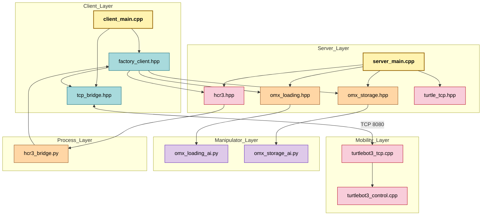

# <span style="color:#97BC62">스마트팩토리 물류 자동화 시스템 (Smart Factory Logistics Automation)

> `OMX(로봇팔)`, `TurtleBot`, `HCR-3`를 연동하여 박스를 적재소에서 집어 레일 구역으로 이송하고, 후속 공정까지 자동으로 연결하는 `ROS2` 기반의 스마트팩토리 물류 자동화 프로젝트입니다.

<br>

## <span style="color:#f400fe">주요 기능 (Key Features)

* <span style="color:#3daeff">**분산 공정 제어**</span>: `Main Server`가 여러 장비를 하나의 공정으로 묶어 전체 물류 사이클을 순차적으로 조정합니다.
* <span style="color:#3daeff">**모바일 로봇 이송**</span>: `TurtleBot`이 적재소와 레일 구역 사이를 이동하며 박스 운반 흐름을 담당합니다.
* <span style="color:#3daeff">**이중 로봇팔 작업**</span>: `OMX Loading`과 `OMX Storage`가 각각 픽업과 적치 작업을 분담해 자동화 공정을 수행합니다.
* <span style="color:#3daeff">**후속 공정 연계**</span>: `HCR-3`가 박스 요청, 공정 완료, 다음 사이클 시작 신호를 전달하며 후속 작업을 이어갑니다.
* <span style="color:#3daeff">**TCP-ROS2 브리지 구조**</span>: TCP 통신과 `ROS2 Topic/Action`을 연결해 이기종 장비 간 협업을 가능하게 합니다.

<br>

## <span style="color:#f400fe">시스템 아키텍처 (System Architecture)

이 프로젝트는 `Main Server`를 중심으로 `TurtleBot`, `OMX`, `HCR-3`가 분산 연결되는 <span style="color:#dca400">멀티 디바이스 오케스트레이션 구조</span>로 설계되었습니다. 실제 코드 기준으로는 `client_main.cpp`가 공정 제어와 외부 TCP 클라이언트를 담당하고, `server_main.cpp`가 장비용 액션 서버와 TurtleBot TCP 서버를 함께 실행합니다.



<br>

## <span style="color:#f400fe">파일 구조 (File Structure)

프로젝트는 장비 역할과 실행 환경에 맞춰 폴더를 분리하여 <span style="color:#dca400">확장성</span>과 <span style="color:#dca400">운영 분리</span>를 높인 구조로 구성되어 있습니다.

```text
.
├── Main_Server/                         # 전체 공정 순서를 조정하는 중앙 제어 영역
│   ├── custom_interfaces/               # 서버 측 공용 ROS2 인터페이스
│   └── smart_factory_server/            # 메인 서버 및 공정 오케스트레이션 패키지
│       ├── include/smart_factory_server/
│       │   ├── client/                  # 공정 호출 및 TCP 브리지 클라이언트
│       │   └── server/                  # OMX, HCR-3, TurtleBot 연동 서버
│       └── src/
│           ├── client/client_main.cpp   # 공정 흐름 실행 노드
│           └── server/server_main.cpp   # 액션 서버/TCP 브리지 실행 노드
│
├── Tuttlebot/                           # TurtleBot 이동 제어 관련 패키지
│   └── logistics_pkg/
│       ├── src/
│       │   ├── logistics_controller.cpp
│       │   ├── turtlebot3_control.cpp
│       │   ├── turtlebot3_direct_control.cpp
│       │   ├── turtlebot3_tcp.cpp
│       │   └── waypoint_tester.cpp
│       └── CMakeLists.txt
│
├── OMX_Loadingstation/                  # 적재소 OMX 로봇팔 영역
│   ├── Openmanuplator/                  # OpenMANIPULATOR 관련 리소스
│   └── PhysicalAI/
│       ├── custom_interfaces/           # OMX 전용 ROS2 인터페이스
│       ├── omx_action/                  # OMX Loading 액션 서버
│       └── omx_inference/               # 카메라/정책 모델 기반 추론 및 제어
│
├── OMX_Storage/                         # 레일 구역 OMX 로봇팔 영역
│   └── PhysicalAI/
│       ├── custom_interfaces/           # OMX 전용 ROS2 인터페이스
│       ├── omx_action/                  # OMX Storage 액션 서버
│       └── omx_inference/               # Storage 작업 추론 및 제어
│
├── HCR-3_Raspberry_PI/                  # HCR-3 ROS2 브리지 및 액션 서버
│   └── ros2/
│       ├── custom_interfaces/           # HCR-3 인터페이스 정의
│       ├── hcr3_action/                 # HCR-3 액션 서버
│       └── hcr3_bridge_pkg/             # 외부 Python 프로세스와 ROS2 연결
│
└── HCR-3_STM32/                         # HCR-3 보조 제어용 MCU 코드
```

<br>

## <span style="color:#f400fe">공정 흐름 (Process Flow)

현재 코드 기준 물류 자동화 사이클은 아래 순서로 동작합니다.

1. `HCR-3 Bridge`가 박스 필요 신호를 ROS 토픽으로 발행합니다.
2. `factory_client`가 요청을 감지하고 `TurtleBot` 이동 명령을 전송합니다.
3. `TurtleBot`이 적재소 또는 레일 구역으로 이동하고 상태를 TCP/토픽으로 회신합니다.
4. `Main Server`가 상태에 맞춰 `OMX Loading` 또는 `OMX Storage` 액션을 호출합니다.
5. 각 `OMX` 추론 노드가 실제 로봇팔 작업을 수행하고 완료 결과를 반환합니다.
6. 적치 작업이 끝나면 `HCR-3` 액션이 호출되어 후속 공정을 수행합니다.
7. 공정 완료 후 다음 박스 요청을 받아 동일한 사이클을 반복합니다.

<br>

## <span style="color:#f400fe">주요 모듈 설명 (Core Modules)

### 1. Main Server

`Main_Server/smart_factory_server`는 전체 자동화 공정을 조율하는 핵심 패키지입니다.

* `src/server/server_main.cpp`: OMX Loading, OMX Storage, HCR-3 액션 서버와 Main Server 측 `TurtleTCP` 노드를 함께 실행합니다.
* `src/client/client_main.cpp`: `factory_client`와 `TcpBridgeNode`를 함께 실행하며 전체 공정 순서를 제어합니다.
* `include/smart_factory_server/client/factory_client.hpp`: 장비 상태를 받아 다음 액션을 순차적으로 호출합니다.
* `include/smart_factory_server/client/tcp_bridge.hpp`: Main Server 측 TCP 클라이언트로 동작하며 TurtleBot 측 TCP 서버와 연결됩니다.

### 2. TurtleBot

`Tuttlebot/logistics_pkg`는 이동 로봇 제어와 통신을 담당합니다.

* `turtlebot3_control.cpp`: `Nav2 navigate_to_pose` 액션을 이용한 위치 이동을 수행합니다.
* `turtlebot3_direct_control.cpp`: `cmd_vel` 기반 직접 제어 경로를 제공합니다.
* `turtlebot3_tcp.cpp`: TurtleBot 측 TCP 서버로 동작하며 Main Server와 명령/상태를 주고받습니다.
* `waypoint_tester.cpp`: 웨이포인트 이동 테스트를 위한 실험용 노드입니다.

### 3. OMX Loading / OMX Storage

각 OMX 장비는 액션 계층과 AI 추론 계층으로 분리되어 있습니다.

* `omx_action`: 메인 서버의 goal을 받아 내부 작업 토픽으로 전달하는 ROS2 액션 서버입니다.
* `omx_inference`: 카메라 입력, joint state, 정책 모델을 이용해 실제 로봇팔 제어를 수행합니다.

관련 파일 예시:

* `OMX_Loadingstation/PhysicalAI/omx_action/src/omx_loading_action.cpp`
* `OMX_Loadingstation/PhysicalAI/omx_inference/omx_inference/omx_loading_ai.py`
* `OMX_Storage/PhysicalAI/omx_action/src/omx_storage_action.cpp`
* `OMX_Storage/PhysicalAI/omx_inference/omx_inference/omx_storage_ai.py`

### 4. HCR-3

`HCR-3`는 후속 공정과 외부 장치 연동을 담당합니다.

* `HCR-3_Raspberry_PI/ros2/hcr3_action/src/hcr3_action.cpp`: HCR-3 액션 서버입니다.
* `HCR-3_Raspberry_PI/ros2/hcr3_bridge_pkg/hcr3_bridge_pkg/hcr3_bridge.py`: 외부 Python 비전/센서 프로세스와 ROS2를 연결합니다.

<br>

## <span style="color:#f400fe">설치 및 실행 방법 (Installation & Usage)

### 1. 환경 설정 (Environment Setup)

&emsp;&emsp;**1) 프로젝트 클론**
```bash
git clone <repository-url>
cd SmartFactory-Logistics-Automation-main
```

&emsp;&emsp;**2) ROS2 워크스페이스 준비**
```bash
source /opt/ros/<distro>/setup.bash
```

&emsp;&emsp;**3) 패키지 빌드**
```bash
colcon build --packages-select smart_factory_server logistics_pkg hcr3_action
```

> **Note**: `OMX` 추론 노드는 별도의 AI 실행 환경, 카메라 설정, 정책 모델 파일이 필요합니다.

### 2. 주요 노드 실행 (Run the Core Nodes)

운영 환경에서는 장비별 워크스페이스와 네트워크 설정을 맞춘 뒤 각 노드를 순서대로 실행해야 합니다.

```bash
ros2 run smart_factory_server server_main
ros2 run smart_factory_server client_main
```

필요에 따라 아래 장비 노드를 각각 추가 실행합니다.

```bash
ros2 run logistics_pkg turtlebot3_tcp
ros2 run hcr3_action hcr3_action
```

### 3. OMX / HCR-3 연동 준비 (Device Integration)

실제 공정 실행 전에는 아래 항목을 먼저 확인해야 합니다.

* 장비별 IP 및 TCP 포트 설정
* ROS2 토픽명, 액션명, 인터페이스명 일치 여부
* OMX 정책 모델 및 카메라 입력 경로
* HCR-3 브리지 Python 프로세스 실행 상태

<br>

## <span style="color:#f400fe">주요 기술 스택 (Tech Stack)

- **언어**: `C++`, `Python`
- **로봇 미들웨어**: `ROS2`, `rclcpp`, `rclpy`
- **분산 제어**: `ROS2 Action`, `ROS2 Topic`, `TCP Socket`
- **이동 제어**: `Nav2`, `TurtleBot3`
- **로봇팔 및 비전**: `OpenMANIPULATOR-X`, `OpenCV`
- **AI 추론**: `PyTorch`, `LeRobot ACT policy`
- **네트워크 통신**: `Boost.Asio`

<br>

## <span style="color:#f400fe">현재 코드베이스 주의사항 (Known Issues)

코드 분석 기준으로 실제 운영 전에 아래 항목을 우선 점검하는 것이 좋습니다.

* <span style="color:#dca400">**액션 이름 불일치 가능성**</span>: `factory_client.hpp`는 `/loading/server`, `/storage/server`, `/hcr3/server`를 사용하지만 서버 구현은 `/omx_loading`, `/omx_storage`, `/hcr3`를 사용합니다.
* <span style="color:#dca400">**TurtleBot 제어 경로 중복**</span>: `turtlebot3_control.cpp`, `turtlebot3_direct_control.cpp`, `logistics_controller.cpp`가 공존합니다.
* <span style="color:#dca400">**TCP 프로토콜 혼재**</span>: Main Server 쪽 `tcp_bridge.hpp`와 TurtleBot 쪽 구현 사이에 문자열 처리 방식 차이가 있습니다.
* <span style="color:#dca400">**액션 안정성 보강 필요**</span>: 일부 액션 서버는 동시 goal 처리나 타임아웃 상황에 충분히 안전하지 않을 수 있습니다.
* <span style="color:#dca400">**네이밍 혼선 가능성**</span>: Main Server와 TurtleBot 양쪽에 모두 `TurtleTCP`/`tcp_bridge_node` 계열 이름이 존재해 역할 구분이 문서상 필요합니다.

<br>

## <span style="color:#f400fe">향후 개선 계획 (Future Plans)

- <span style="color:#dca400">**통신 규격 통일**</span>: 액션 이름, 토픽 이름, TCP 프로토콜을 운영 기준으로 단일화
- <span style="color:#dca400">**운영 경로 정리**</span>: TurtleBot 제어 코드와 테스트 코드를 분리하고 실제 운영 경로를 명확화
- <span style="color:#dca400">**런치 파일 정비**</span>: 장비별 실행 순서를 `launch` 기반으로 재구성해 배포 편의성 향상
- <span style="color:#dca400">**장애 대응 강화**</span>: 타임아웃, 재시도, 상태 복구 로직을 추가해 공정 안정성 개선
- <span style="color:#dca400">**문서 고도화**</span>: 실제 운영 토폴로지, 네트워크 설정, 장비별 실행 절차를 세분화하여 문서화
